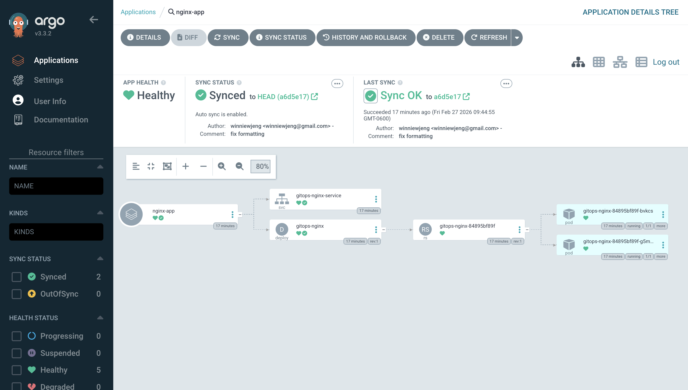

# DAY 6 — ARGOCD: GITOPS-BASED CONTINUOUS DEPLOYMENT

## Goal

Install ArgoCD, connect it to a Git repo, and deploy via GitOps.

## Concepts to Learn

- **What is GitOps?** Git as the single source of truth for deployments
- **What is ArgoCD?** A declarative GitOps CD tool for Kubernetes
- **Application CRD:** Tells ArgoCD what repo to watch + where to deploy
- **Sync:** ArgoCD compares Git state vs cluster state and reconciles
- **Self-healing:** If someone changes the cluster manually, ArgoCD reverts it

---

## Step 1: Install ArgoCD

Download and install official ArgoCD components (most up-to-date official manifests) into your cluster.

```bash
kubectl create namespace argocd
kubectl apply -n argocd -f https://raw.githubusercontent.com/argoproj/argo-cd/stable/manifests/install.yaml
kubectl get pods -n argocd   # Wait until all pods are Running
```

### What gets installed (5-6 pods):

| Pod                             | Purpose                                 |
| ------------------------------- | --------------------------------------- | --- |
| `argocd-server`                 | The UI dashboard (localhost:8080)       |
| `argocd-repo-server`            | Clones Git repos + monitors for changes |
| `argocd-application-controller` | Reconciles cluster state with Git       |
| `argocd-dex-server`             | Handles authentication                  | `   |
| `argocd-redis`                  | Caches data for performance             |

---

## Step 2: Install the ArgoCD CLI

```bash
brew install argocd
```

---

## Step 3: Access the ArgoCD UI

Forward traffic from local machine's port 8080 to port 443 on the argocd-server Service inside the argocd namespace.

```bash
kubectl port-forward svc/argocd-server -n argocd 8080:443
```

**What this does:**

- `kubectl port-forward`: creates a tunnel between your local machine and a cluster resource
- `svc/argocd-server`: targets the Service named argocd-server
- `-n argocd`: in the argocd namespace
- `8080:443`: maps local port 8080 → remote port 443 (HTTPS)
- The tunnel stays active while the command runs; Ctrl+C stops it

Open https://localhost:8080 (accept the self-signed cert warning)

### Get the initial admin password:

```bash
argocd admin initial-password -n argocd
```

### Login:

- **Username:** admin
- **Password:** (from command above)

### Also login via CLI:

```bash
argocd login localhost:8080 --insecure
```

### Change the password (recommended):

```bash
argocd account update-password
```

**New password:** hlpdwxLxCHthx9K1

---

## Step 4: Prepare a Git repository

Create a new GitHub repo called "k8s-gitops-demo" (or any name).

Clone it locally (keep it separate from LearnK8s since that's already git-controlled):

```bash
cd ~/Documents
git clone https://github.com/<your-username>/k8s-gitops-demo.git
cd k8s-gitops-demo
```

### Create a simple app manifest:

```bash
mkdir -p apps/nginx
```

Create `apps/nginx/deployment.yaml`

Create `apps/nginx/service.yaml`

### Push to GitHub:

```bash
git add .
git commit -m "Initial nginx manifests"
git push origin main
```

---

## Step 5: Create an ArgoCD Application

Set up a continuously-syncing link between the folder containing manifests in your GitHub repo and the default namespace in your cluster. Any push to that repo folder automatically updates the cluster, any manual cluster drift gets reverted, and any removed manifest gets cleaned up.

### Via CLI:

```bash
argocd app create nginx-app \
    --repo https://github.com/winniewjeng/k8s-gitops-demo.git \
    --path apps/nginx \
    --dest-server https://kubernetes.default.svc \
    --dest-namespace default \
    --sync-policy automated \
    --self-heal \
    --auto-prune
```

### Flag breakdown:

| Flag                      | What it does                                                                                       |
| ------------------------- | -------------------------------------------------------------------------------------------------- |
| `nginx-app`               | Name of the ArgoCD Application resource                                                            |
| `--repo`                  | The Git repository ArgoCD will watch for K8s manifests                                             |
| `--path`                  | Folder inside the repo containing the manifests (apps/nginx)                                       |
| `--dest-server`           | Target K8s cluster; https://kubernetes.default.svc = this same cluster ArgoCD is running in        |
| `--dest-namespace`        | Namespace where manifests will be deployed (default)                                               |
| `--sync-policy automated` | Auto-apply changes when Git diverges from cluster (no manual "Sync" click needed)                  |
| `--self-heal`             | If someone manually changes the cluster, ArgoCD reverts it back to match Git                       |
| `--auto-prune`            | If a manifest is deleted from Git, ArgoCD also deletes the corresponding resource from the cluster |

### FAQ:

**Q: Why deploy to 'default' namespace when ArgoCD is in 'argocd' namespace?**

A: The `argocd` namespace is the **CONTROL PLANE** (where ArgoCD components run). The `--dest-namespace` is the **DATA PLANE** (where your apps get deployed).

```
┌──────────────────────────────────────────┐
│ argocd namespace (control plane)         │
│ ├── argocd-server                        │
│ ├── argocd-repo-server                   │
│ └── argocd-application-controller        │
└──────────────────────────────────────────┘
                ↓ watches Git & deploys to
┌──────────────────────────────────────────┐
│ default namespace (your app)             │
│ ├── nginx deployment                     │
│ ├── nginx service                        │
│ └── nginx pods                           │
└──────────────────────────────────────────┘
```

**Best practice:** Keep them separate for isolation, multi-tenancy, and security.

**Q: What if I have nested directories or multiple paths?**

A: Nested paths work fine—ArgoCD recursively finds all YAML files:

```bash
--path apps/nginx/staging              ✓ Works
--path apps/nginx/prod/us-east-1       ✓ Works
```

Point `--path` to the directory containing manifests (not individual files).

For multiple paths, create separate Applications:

```bash
argocd app create nginx-staging --path apps/nginx/staging ...
argocd app create nginx-prod --path apps/nginx/prod ...
```

Or use Kustomize overlays to avoid duplication.

**Q: What if my manifests are Helm charts?**

A: ArgoCD auto-detects Helm if `Chart.yaml` exists in the path:

```
apps/nginx/
  Chart.yaml          ← ArgoCD detects this
  values.yaml
  templates/
    deployment.yaml
```

ArgoCD will run `helm template` and apply the rendered manifests.

Override values with:

```bash
--helm-set replicas=5,image.tag=v2.0
--values helm/custom-values.yaml
```

### Or via the UI:

1. Click "+ New App"
2. Fill in:
   - **Application Name:** nginx-app
   - **Project:** default
   - **Sync Policy:** Automatic
   - **Repository URL:** your GitHub repo URL
   - **Path:** apps/nginx
   - **Cluster:** https://kubernetes.default.svc
   - **Namespace:** default
3. Click "Create"

---

## Step 6: Watch the magic

```bash
argocd app get nginx-app
kubectl get pods             # ArgoCD deployed your pods!
```

In the ArgoCD UI, you'll see a beautiful dependency graph of your resources.



The UI shows:

- **App Health:** Healthy (green check)
- **Sync Status:** Synced (auto-sync enabled)
- **Resource Graph:** Visual dependency tree showing the application, service, deployment, ReplicaSet, and pods
- **Last Sync:** Timestamp and commit author/message

---

## Step 7: GitOps in action — change Git, watch it deploy

Edit `apps/nginx/deployment.yaml` in your repo:

- Change `replicas: 2` → `replicas: 4`

### Push:

```bash
git add . && git commit -m "Scale to 4 replicas" && git push
```

Within ~3 minutes (or click "Sync" in the UI), ArgoCD will detect the change and scale your deployment automatically.

```bash
kubectl get pods   # 4 pods now!
```

---

## Step 8: Test self-healing

Manually scale down:

```bash
kubectl scale deployment gitops-nginx --replicas=1
```

Wait a moment... ArgoCD will detect the drift and restore 4 replicas!

```bash
kubectl get pods   # Back to 4
```

---

## Day 6 Checkpoint

- [✓] ArgoCD installed in the argocd namespace
- [✓] ArgoCD CLI installed, logged in
- [✓] Accessed ArgoCD UI at localhost:8080
- [✓] Created a GitHub repo with K8s manifests
- [✓] Created an ArgoCD Application pointing to the repo
- [✓] Made a Git change and watched ArgoCD auto-deploy it
- [✓] Tested self-healing
